# TravelMate Project Documentation

This document provides a comprehensive overview of the TravelMate project architecture, its components, and how data and processes flow through the system.

## 🏗️ System Architecture

TravelMate is built using a **Layered (N-Tier) Architecture** in Go, ensuring a clean separation of concerns, testability, and maintainability.

### High-Level Component Diagram

## 🏗️ Detailed System Architecture

TravelMate uses a sophisticated composite architecture combining a layered web server with standalone TCP and gRPC services.

### Comprehensive Component & Flow Diagram

```mermaid
graph TB
    subgraph "External Sources"
        Browser["🌐 User Browser (HTML/JS/CSS)"]
        TCPClient["📟 Raw TCP Client (Telnet/Netcat)"]
    end

    subgraph "Web Application Server (Port 8080)"
        direction TB
        subgraph "Interface Layer"
            Router["🛣️ Gorilla Mux Router"]
            Middleware["🔒 Auth / 📝 Logging Middleware"]
            
            subgraph "Handlers"
                TmplHandler["📄 Template Handler (HTML)"]
                APIHandler["📡 API Handler (JSON)"]
                WSHandler["🔄 WebSocket Handler (Chat)"]
                RecHandler["💡 Rec. Handler (gRPC Client)"]
            end
        end

        subgraph "Business Logic Layer"
            UserService["👤 User Service"]
            TripService["✈️ Trip Service"]
        end

        subgraph "Data Access Layer"
            UserRepo["🗂️ User Repository"]
            TripRepo["🗂️ Trip Repository"]
        end
    end

    subgraph "Communication & Data Protocols"
        WSProtocol["🔌 WebSocket (Real-time)"]
        gRPCProtocol["⚡ gRPC / Protobuf (RPC)"]
        TCPProtocol["🔌 Raw TCP (Socket)"]
    end

    subgraph "Specialized Background Services"
        TCPChat["💬 TCP Chat Server (Port 9090)"]
        gRPCRec["🚀 Recommendation Server (Port 50051)"]
    end

    subgraph "Storage Layer"
        DB[("🗄️ SQLite Database (GORM)")]
    end

    %% Connections
    Browser <-->|HTTP/HTTPS| Router
    TCPClient <-->|TCP/IP| TCPChat
    
    Router --> Middleware
    Middleware --> TmplHandler & APIHandler & WSHandler & RecHandler
    
    TmplHandler & APIHandler & WSHandler & RecHandler --> UserService & TripService
    UserService & TripService --> UserRepo & TripRepo
    UserRepo & TripRepo --> DB
    
    WSHandler <--> WSProtocol <--> Browser
    RecHandler <--> gRPCProtocol <--> gRPCRec
    gRPCRec -.->|Uses| TripService
```

---

## 📂 Project Structure & Layers (Deep Dive)

### 1. Network & Entry Level
- **Core Orchestrator (`main.go`)**: Manages the lifecycle of three concurrent servers:
  - **HTTP Server (8080)**: Handles web and API traffic.
  - **TCP Server (9090)**: Dedicated high-performance chat service.
  - **gRPC Server (50051)**: Internal service for complex recommendations.

### 2. Application Logic Layers
- **Models (`internal/models`)**: Defines the source of truth for data structures. Uses GORM tags for automated schema mapping.
- **Repositories (`internal/repository`)**: Implements the *Repository Pattern*. Each repository is defined by an interface, allowing the database to be swapped (e.g., SQLite to PostgreSQL) without changing business logic.
- **Services (`internal/services`)**: The "brain" of the app. Handles data validation, password hashing (Bcrypt), and complex business rules.
- **Handlers (`internal/handlers`)**: The "connectors". They translate network protocols (HTTP/JSON/Templates) into service calls.

### 3. Real-time & RPC Services
- **`internal/chat`**: Implements a broadcast hub for TCP clients. Manages connection pools and message distribution.
- **`internal/grpc`**: Implements the logic for `AnalyzeBudget` and `GetRecommendations`. It uses Protobuf for high-speed serialization.

### 4. Frontend Ecosystem
- **Rendering**: Uses `html/template` for secure, server-side HTML generation.
- **Dynamic Assets**:
  - `main.js`: Core UI logic, form handling, and global event listeners.
  - `profile.js` / `dashboard.js`: Feature-specific interactive elements.
  - `style.css`: Comprehensive design system built with vanilla CSS variables.

---

## 🔄 Lifecycle of a Budget Analysis Request

1. **User Action**: User clicks "Analyze Budget" in the Trip Detail page.
2. **Frontend**: `main.js` collects expense data from the DOM and sends a `GET` request to `/api/trips/{id}/budget/analyze`.
3. **HTTP Handler**: `RecommendationHandler.AnalyzeBudgetByTripID` is triggered.
4. **Service Call**: Handler fetches the trip data using `TripService`.
5. **gRPC Transition**: Handler transforms the Go struct data into a `pb.BudgetAnalysisRequest`.
6. **RPC Execution**: The request is sent to the local gRPC server (Port 50051).
7. **Processing**: `RecommendationServer` calculates percentages, flags warnings, and generates suggestions.
8. **JSON Delivery**: The result flows back to the Handler, gets encoded to JSON, and is updated on the UI via JavaScript.

---

## 🛠️ Technology Stack

| Component | Technology |
| :--- | :--- |
| **Language** | Go (Golang) |
| **HTTP Router** | Gorilla Mux |
| **Database** | SQLite with GORM |
| **Real-time** | Gorilla WebSocket |
| **Communication** | gRPC & Protocol Buffers |
| **Frontend** | Go Templates, Vanilla JS, CSS |
| **Security** | Bcrypt (Password Hashing) |

---

## 📈 Key Features Flow

### User Registration & Login
1. **User** submits form -> **API Handler** receives JSON.
2. **Service** hashes password using `bcrypt`.
3. **Repository** saves record to SQLite.
4. **Middleware** sets a session cookie for subsequent requests.

### Trip Management
1. **User** creates a trip via `/trips/new`.
2. **JavaScript** on the frontend sends a `POST` request to `/api/trips`.
3. **Service** validates dates and user ownership.
4. **Repository** persists the trip and associated participants.
