# TravelMate Project Documentation

This document provides a comprehensive overview of the TravelMate project architecture, its components, and how data and processes flow through the system.

## 🏗️ System Architecture

TravelMate is built using a **Layered (N-Tier) Architecture** in Go, ensuring a clean separation of concerns, testability, and maintainability.

### High-Level Component Diagram

## 🏗️ Detailed System Architecture

TravelMate uses a sophisticated composite architecture combining a layered web server with standalone TCP and gRPC services.

### Comprehensive Component & Flow Diagram

```mermaid
graph TB
    subgraph "External Sources"
        Browser["🌐 User Browser (HTML/JS/CSS)"]
        TCPClient["📟 Raw TCP Client (Telnet/Netcat)"]
    end

    subgraph "Web Application Server (Port 8080)"
        direction TB
        subgraph "Interface Layer"
            Router["🛣️ Gorilla Mux Router"]
            Middleware["🔒 Auth / 📝 Logging Middleware"]
            
            subgraph "Handlers"
                TmplHandler["📄 Template Handler (HTML)"]
                APIHandler["📡 API Handler (JSON)"]
                WSHandler["🔄 WebSocket Handler (Chat)"]
                RecHandler["💡 Rec. Handler (gRPC Client)"]
            end
        end

        subgraph "Business Logic Layer"
            UserService["👤 User Service"]
            TripService["✈️ Trip Service"]
        end

        subgraph "Data Access Layer"
            UserRepo["🗂️ User Repository"]
            TripRepo["🗂️ Trip Repository"]
        end
    end

    subgraph "Communication & Data Protocols"
        WSProtocol["🔌 WebSocket (Real-time)"]
        gRPCProtocol["⚡ gRPC / Protobuf (RPC)"]
        TCPProtocol["🔌 Raw TCP (Socket)"]
    end

    subgraph "Specialized Background Services"
        TCPChat["💬 TCP Chat Server (Port 9090)"]
        gRPCRec["🚀 Recommendation Server (Port 50051)"]
    end

    subgraph "Storage Layer"
        DB[("🗄️ SQLite Database (GORM)")]
    end

    %% Connections
    Browser <-->|HTTP/HTTPS| Router
    TCPClient <-->|TCP/IP| TCPChat
    
    Router --> Middleware
    Middleware --> TmplHandler & APIHandler & WSHandler & RecHandler
    
    TmplHandler & APIHandler & WSHandler & RecHandler --> UserService & TripService
    UserService & TripService --> UserRepo & TripRepo
    UserRepo & TripRepo --> DB
    
    WSHandler <--> WSProtocol <--> Browser
    RecHandler <--> gRPCProtocol <--> gRPCRec
    gRPCRec -.->|Uses| TripService
```

---

## 📂 Project Structure & Layers

### 1. Entry Point (`/cmd`)
- **`cmd/web/main.go`**: The heart of the application. It initializes the database, wires up the repository, service, and handler layers, defines routes, and starts the HTTP, TCP, and gRPC servers.

### 2. Internal Logic (`/internal`)
- **`models/`**: Defines the data structures (e.g., `User`, `Trip`, `Expense`) used across all layers and for database mapping (GORM).
- **`repository/`**: Abstraction layer for data persistence. Interacts directly with the GORM DB instance.
- **`services/`**: Contains core business logic (e.g., authentication rules, budget calculations). It sits between handlers and repositories.
- **`handlers/`**: Manages incoming requests.
    - **Template Handlers**: Render HTML pages using Go templates.
    - **API Handlers**: Handle JSON-based RESTful requests.
- **`middleware/`**: Cross-cutting concerns like logging and session-based authentication.
- **`database/`**: Handles SQLite connection and GORM auto-migrations.
- **`chat/`**: Implements the TCP chat server logic.
- **`grpc/`**: Implements the gRPC server for recommendation services.

### 3. Frontend (`/web`)
- **`templates/`**: Server-side rendered HTML files using Go's `html/template` engine. Organized into `layouts/`, `partials/`, and `pages/`.
- **`static/`**: Client-side assets including Vanilla CSS for styling and JavaScript for dynamic UI interactions (e.g., AJAX calls, Chart.js for data visualization).

---

## 🔄 Internal Flow & Processes

### 1. Request Lifecycle (HTTP)
1. **Inbound**: A user visits a URL (e.g., `/dashboard`).
2. **Middleware**: `AuthMiddleware` checks if the user is logged in (session cookie/context).
3. **Handler**: `TemplateHandler.Dashboard` is called.
4. **Service**: Handler calls `TripService.GetMyTrips(userID)`.
5. **Repository**: Service calls `TripRepository.FindTripsByUserID(userID)`.
6. **Database**: GORM executes the SQL query against `travel-platform.db`.
7. **Response**: Data flows back up; the handler executes the HTML template with the data and returns it to the browser.

### 2. Real-time Communication (WebSocket/TCP)
- **Web Chat**: Uses Gorilla WebSocket. Messages are handled by `WebSocketHandler`, allowing real-time interaction between users in the same trip context.
- **Direct Chat**: A separate TCP server (port 9090) allows direct raw socket connections for low-level chat functionality.

### 3. Recommendation Engine (gRPC)
- The web server acts as a gRPC client (internally or to its own gRPC server on port 50051) to fetch trip recommendations, separating intensive logic from the main web loop.

---

## 🛠️ Technology Stack

| Component | Technology |
| :--- | :--- |
| **Language** | Go (Golang) |
| **HTTP Router** | Gorilla Mux |
| **Database** | SQLite with GORM |
| **Real-time** | Gorilla WebSocket |
| **Communication** | gRPC & Protocol Buffers |
| **Frontend** | Go Templates, Vanilla JS, CSS |
| **Security** | Bcrypt (Password Hashing) |

---

## 📈 Key Features Flow

### User Registration & Login
1. **User** submits form -> **API Handler** receives JSON.
2. **Service** hashes password using `bcrypt`.
3. **Repository** saves record to SQLite.
4. **Middleware** sets a session cookie for subsequent requests.

### Trip Management
1. **User** creates a trip via `/trips/new`.
2. **JavaScript** on the frontend sends a `POST` request to `/api/trips`.
3. **Service** validates dates and user ownership.
4. **Repository** persists the trip and associated participants.
